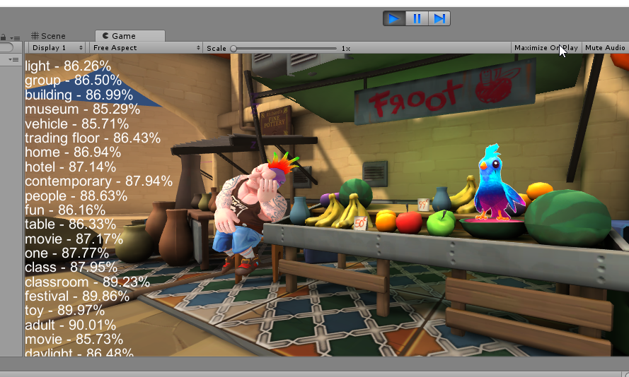
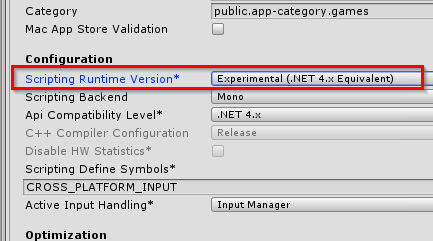
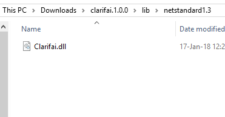

# Using Clarifai C# API with Unity

In addition to many other .NET platforms, the Clarifai C# library can be used with the Unity game engine which means having access to all of the Clarifai's API functionality from a Unity project. Possibilities are numerous, including using our publicly available models to find out what's on screen, or you creating custom private models, train it on sample data beforehand that make sense for the game, and later use it to do predictions, maybe of a only a part of the screen.

# Sample Project

We've taken a sample game project called [Adventure](https://www.assetstore.unity3d.com/en/#!/content/76216), stripped away most of the non-essential assets, and used the Clarifai C# library to predict what's on screen.

Since the project contains assets, it's uploaded as a ZIP file. You can download it [from this link](https://drive.google.com/file/d/112jTSn_pZh2vyZd0ntfD9q592TfbeACw/view?usp=sharing).



To open this project using Unity, simply clone the files and open them using Unity 2018.

To inspect and modify the code, open the project using Visual Studio, VS Code, or JetBrains Rider.

# Use Clarifai your own Unity project

## Required platform

In order to enable using the Clarifai C# in your own projects, the runtime has to be set to `.NET 4.x`. This is done by going to `File` -> `Build Settings` -> `Player Settings`. 
Then, under Configuration, `Scripting Runtime Version` has to be set to 
*Experimental (.NET 4.x Equivalent)*.



## No NuGet

How to import the library to Unity? 
Since Unity does not support NuGet, the DLL files have to be copied by hand. Visting [the Clarifai's NuGet Gallery page](https://www.nuget.org/packages/Clarifai), you can click *Manual Download* 
to download a raw nupkg file. It's nothing else than a regular ZIP file with the extension renamed, which means we can extract the 
zipped contents and retrieve the library DLL file! 

The DLL file is located under `lib/netstandard1.3/Clarifai.dll` (note: 1.3 could change in the future). 



Now we simply take this file and copy it to a project in which we want to use it, to the `Assets/Plugins` directory.

We also have to provide an external DLL library that the Clarifai C# library itself uses. It's `Newtonsoft.Json.dll`, isacquired from [the Newtonsoft.Json NuGet page](https://www.nuget.org/packages/Newtonsoft.Json) the same way as before - using the `Manual Download` link and extracting the `*.nupkg` files. 

We then copy `lib/net45/Newtonsoft.Json.dll` to the same `Assets/Plugins` directory in the Unity project.

## Import the library

At this point we are able to import the library in our code. Create a new script, attach it to Camera. To make simple predict calls, these `using` lines will be required:

```
using Clarifai.API;
using Clarifai.DTOs.Inputs;
using Clarifai.DTOs.Predictions;
```

Now you can, for example, take screenshot of your game screen (or just a part of it), use the `Predict` call, and display the results. See this sample project to see how all this is done.

